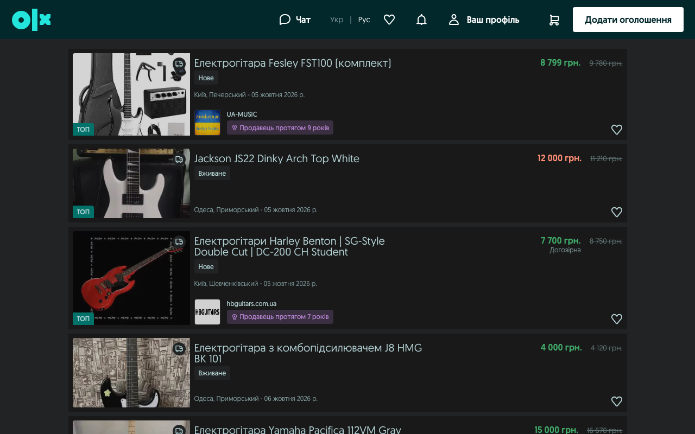
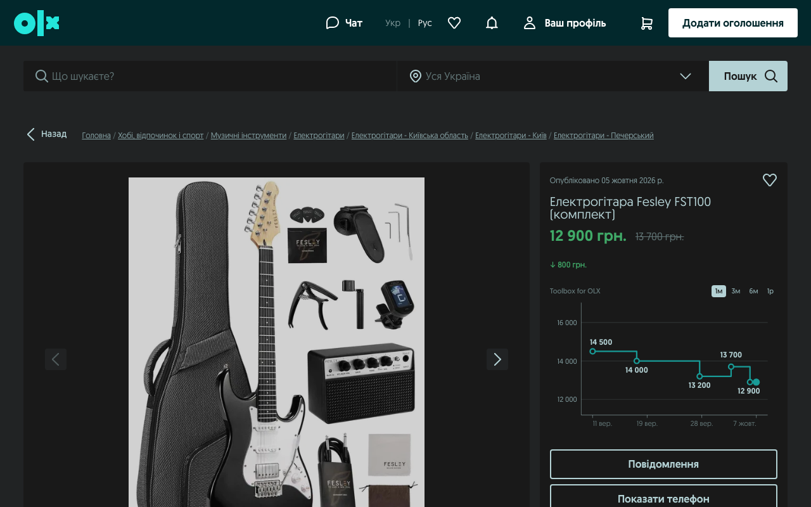
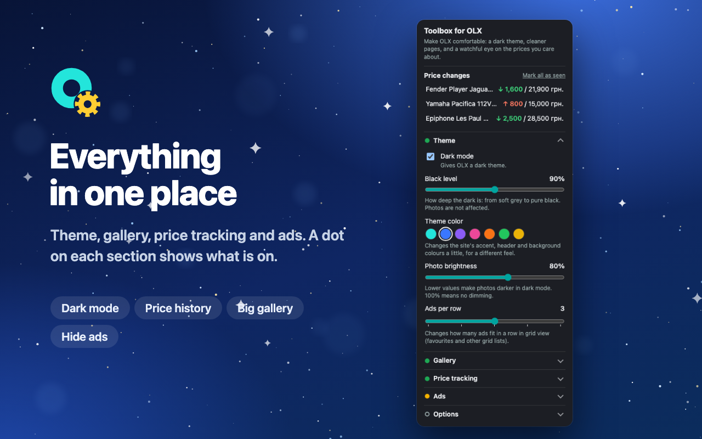
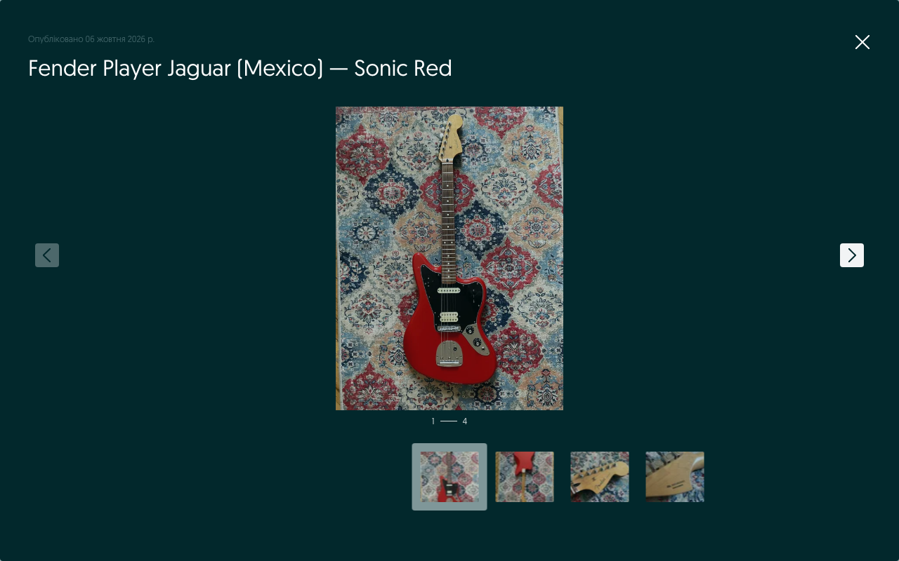

# Toolbox for OLX

A Chrome extension that makes OLX easier on the eyes and keeps an eye on the prices you care about:
a soft **dark mode**, a **large photo gallery**, a **price history** for the ads in your favourites, and a **cleaner view** without ad banners.

_Independent project, not affiliated with OLX._ · [Privacy policy](privacy-policy)

## What it does

**Dark mode**
- A soft dark theme for OLX pages. Photos keep their true colours.
- *Black level* – from soft grey to pure black. *Photo brightness* – dim photos if they feel too bright. *Theme color* – tint the site's accents, header and background.

**Large gallery**
- Ad photos open almost full-screen, with thumbnails. Flip through them with the ← and → keys.

**Price history** (for ads you add to favourites)
- A price chart appears on the ad page.
- In lists (favourites, search results) the current price turns **green** if it dropped and **red** if it rose, with the first recorded price struck through next to it. Hover it for the details.
- Price-change alerts in the extension popup and as a red number on the toolbar icon.

**Cleaner view**
- Hide ad banners and "TOP" ads, and choose how many ads are shown per row.

## Quick start

1. **Open the settings:** click the extension's icon in the toolbar (if you don't see it, click the puzzle-piece icon and pin *Toolbox for OLX*).
2. **Pick your look:** in *Theme* turn dark mode on or off and move the *Black level* and *Photo brightness* sliders. Choose a *Theme color* if you like.
3. **Track prices:** open an OLX ad and add it to your favourites (the heart). From then on its price is saved and the chart appears on the ad page. With *Track all favourites automatically* on, every ad in your favourites is tracked, even the ones you haven't opened.
4. **See changes:** a red number on the toolbar icon and the *Price changes* list in the popup show ads whose price changed since you last looked. Click an item to open the ad.

## Settings explained

| Section | Setting | What it does |
|---|---|---|
| Theme | Dark mode | Turns the dark theme on or off. |
| | Black level | How deep the dark is. Photos are not affected. |
| | Theme color | Changes the site's accent, header and background colours a little. |
| | Photo brightness | 100% means no dimming; lower values make photos darker. |
| | Ads per row | How many ads fit in a row in grid views (favourites and similar lists). |
| Gallery | Large gallery images | Shows photos almost full-screen. |
| | Arrow keys in gallery | Flip through photos with ← and →. |
| Price tracking | Track prices of favourite ads | Master switch for everything below. |
| | Check prices every | 6 hours to 7 days. Prices are also checked when you come back to an OLX tab after the interval has passed. |
| | Track all favourites automatically | Start tracking every ad in your favourites. |
| | Show price changes on cards | The coloured price and the struck-through first price in lists. |
| | Notify about price changes | Alerts in the popup and on the icon; choose all changes, only drops or only rises. |
| Ads | Hide ads and banners / Hide "TOP" ads | Removes banner slots and promoted ads from lists. Best effort: OLX changes its pages often. |
| Options | Language | Ukrainian, English, Polish, Romanian, Bulgarian or Portuguese. |
| | Backup and restore… | Save your settings and price history to a file, or restore them on another computer. |

The small dot in front of each section title shows what is on: **empty** – nothing, **yellow** – some, **green** – everything.

## Good to know

- **Where it works:** olx.ua, olx.pl, olx.bg, olx.ro, olx.pt, olx.kz, olx.uz, olx.com.br and other OLX sites. It is tested mostly on olx.ua; on other sites the dark mode works and the gallery and price features may vary with the page layout.
- **Price tracking only covers ads in your favourites.** The sync button in the *Price tracking* section reads your favourites page now instead of waiting for the interval. You need to be logged in to OLX in the same browser.
- **A page looks wrong?** Turn off *Hide ads and banners* (and *Hide "TOP" ads*) first; they are the most likely cause. You can also switch dark mode off at any time.
- **Your data stays with you.** Settings and price history are stored only in your browser. Nothing is sent anywhere, and removing the extension deletes it. Price history older than a year is dropped automatically, and *Clear history* removes it all. See the [privacy policy](privacy-policy).
- **Moving to another computer?** Use *Backup and restore…* to save the data to a file and restore it there.

## Contact

Questions, bugs or ideas: [skaliozz@gmail.com](mailto:skaliozz@gmail.com)

"OLX" is a trademark of its respective owner. Toolbox for OLX is not affiliated with, endorsed by, or sponsored by OLX.
